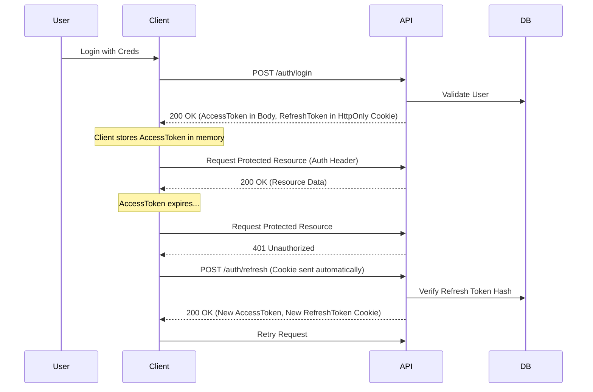

# 🔐 Authentication & Security

> **Secure, Dual-Token JWT System based on Access & Refresh strategy.**

## 🔄 The Authentication Flow

The system uses a robust **Access + Refresh Token** mechanism to balance security and user experience.



*(Note: The diagram above is a Mermaid syntax representation of the implemented logic)*

---

## 🛡 Security Mechanisms

| Mechanism | Implementation | Why? |
| :--- | :--- | :--- |
| **HttpOnly Cookies** | Refresh Token is stored in a cookie with `httpOnly: true`. | Prevents JavaScript from reading the token (XSS protection). |
| **Bcrypt Hashing** | User passwords are hashed before storage. | Standard security for credential storage. |
| **Token Rotation** | Refresh Tokens are rotated on every use. | Prevents replay attacks if a refresh token is stolen. |
| **Role-Based Access** | `RolesGuard` verifies permissions. | Granular control over API endpoints. |

---

## 📡 API Endpoints

### 1. Login
- **endpoint**: `POST /auth/login`
- **body**: `{ "email": "...", "password": "..." }`
- **response**: 
  ```json
  {
    "accessToken": "ey...",
    "user": { "id": "...", "role": "ADMIN" }
  }
  ```
- **side-effect**: Sets `refreshToken` cookie.

### 2. Refresh
- **endpoint**: `POST /auth/refresh`
- **headers**: Cookie must be present.
- **response**: New `accessToken` and updated cookie.

### 3. Logout
- **endpoint**: `POST /auth/logout`
- **action**: Nullifies the refresh token in the DB and clears the cookie.

---

## 🛠 Developer Guide

### Protecting a Route
All routes are **Protected by Default** via the global `JwtAuthGuard`. You do not need to add any decorators to secure a route.

```typescript
// SECURE BY DEFAULT
@Get('profile')
getProfile(@CurrentUser() user: User) {
  return user;
}
```

### Making a Route Public
Use the `@Public()` decorator to bypass the global guard.

```typescript
@Public()
@Get('health')
checkHealth() {
  return 'OK';
}
```

### Accessing User Data
Use the custom decorator `@CurrentUser()` (or `req.user`) to get the payload from the validated token.

```typescript
@Post()
create(@CurrentUser() user: JwtPayload, @Body() dto: CreateDto) {
  // logic...
}
```

### Testing (E2E)
In `NODE_ENV=test`:
- If no `Authorization` header is sent, the guard is **bypassed** automatically (for legacy test compatibility).
- To test actual auth failure, send header: `x-test-force-auth: true`.

---
