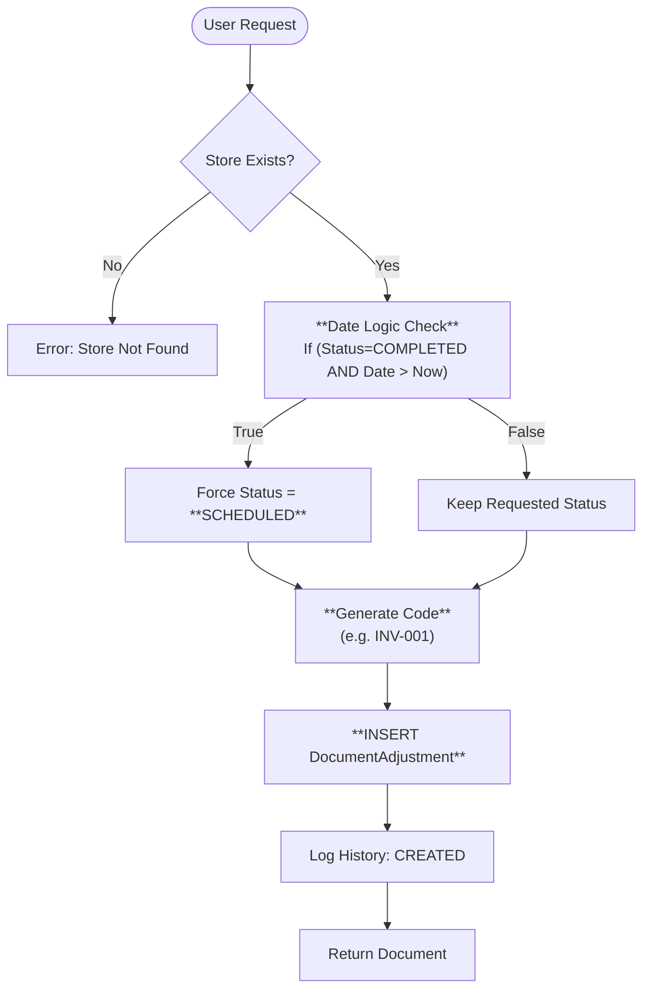
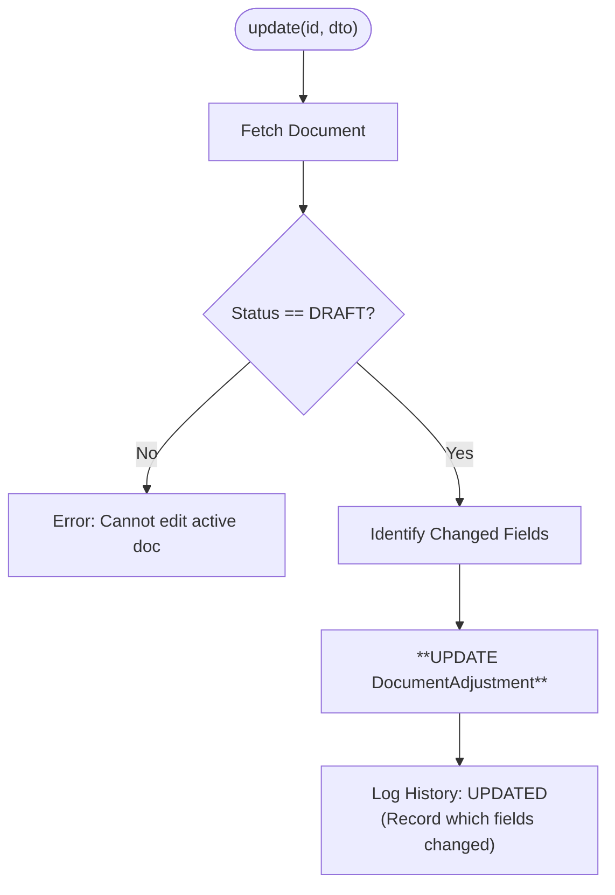
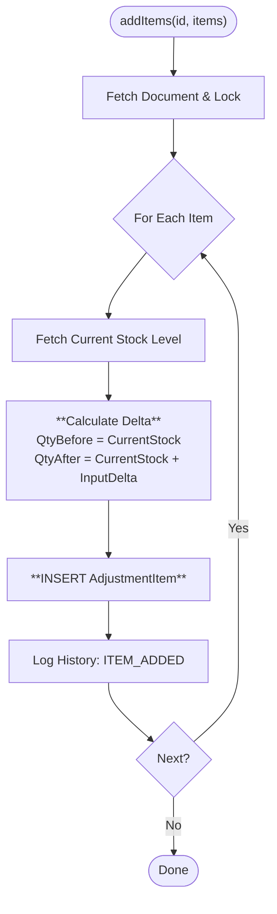
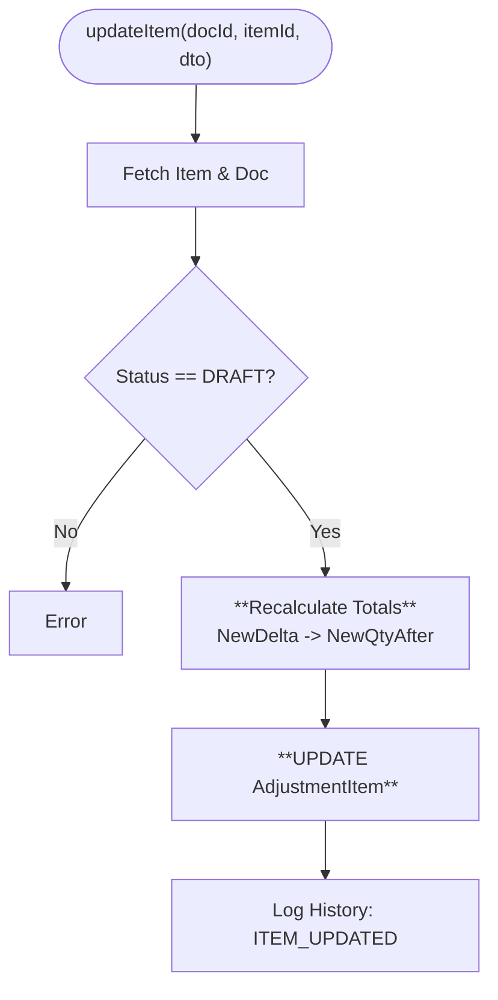
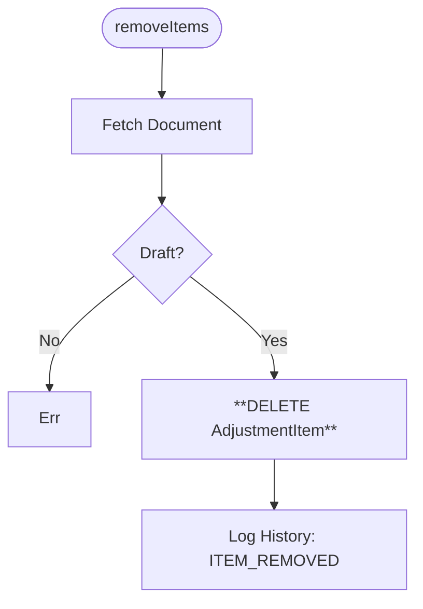
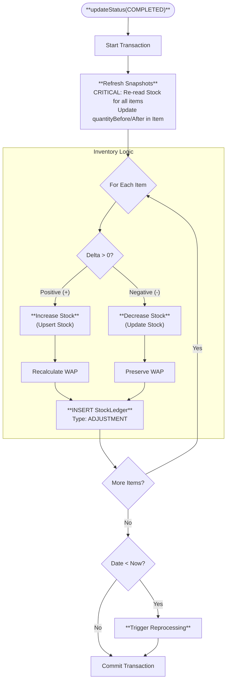
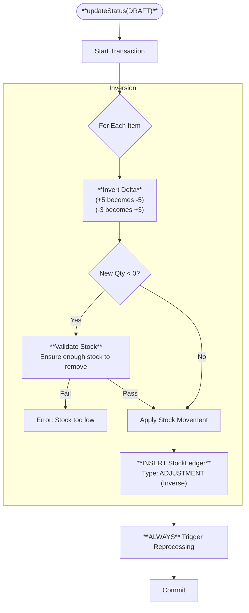
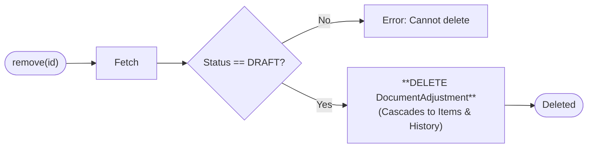

# 🛠 Document Adjustment Methods (Visual Architecture)

> **Complete Method Lifecycle** for Inventory Adjustments.

## 🟢 `create` (Initialization)

**Purpose**: initializes the document header. No changes to stock yet.

## 🟡 `update` (Header Editing)

**Purpose**: Modifies top-level fields (Notes, Date, Store).

## 🔵 `addItems` (Append Logic)

**Purpose**: Adds new lines to the adjustment.
**Key Logic**: Calculates the "Delta" based on *current* stock at the moment of adding.

## 🔵 `updateItem` (Correction Logic)

**Purpose**: Modifies an existing line (e.g. user made a typo in the count).

## 🔴 `removeItems` (Deletion Logic)

**Purpose**: Removes a line from the draft.

## 🌟 `updateStatus` (Commit: DRAFT ➔ COMPLETED)

**Purpose**: Applies the changes to the actual inventory.

## ↩️ `updateStatus` (Revert: COMPLETED ➔ DRAFT)

**Purpose**: Undoes the adjustment.

## 🗑 `remove` (Hard Delete)

**Purpose**: Deletes the document entirely. Only allowed for Drafts.

