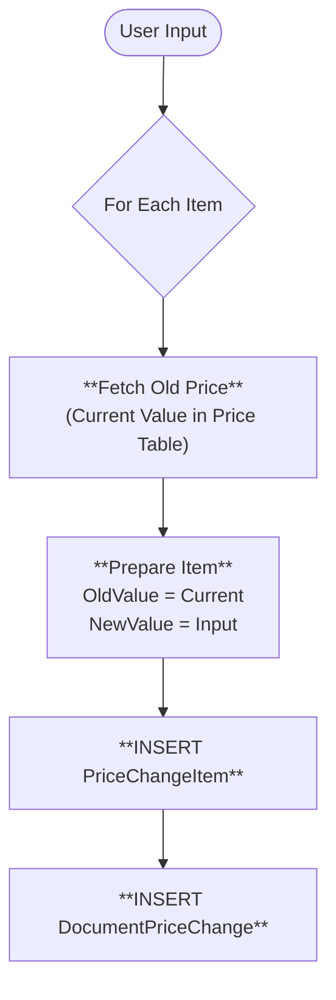
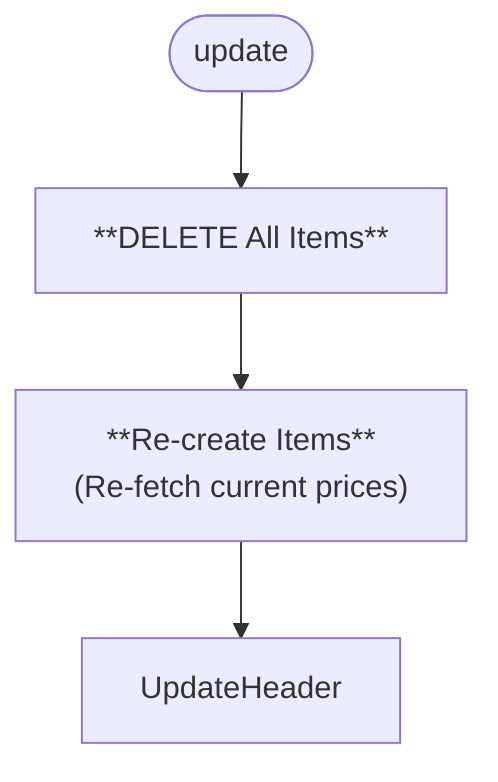
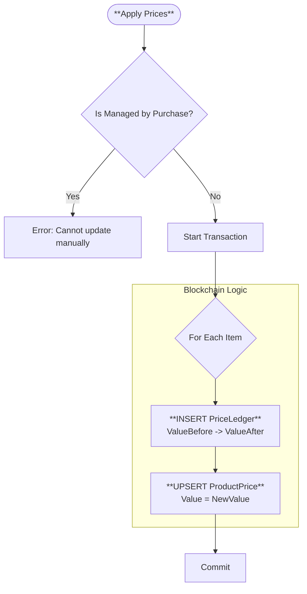
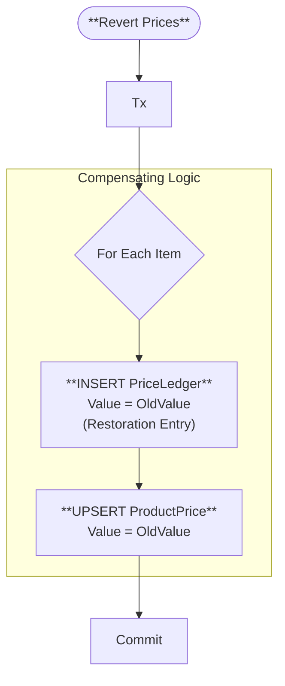

# 🏷 Document Price Change Methods (Visual Architecture)

> **Complete Method Lifecycle** for Price Changes.

## 🟢 `create` (Initialization)

**Purpose**: Prepare new prices.

## 🟡 `update` (Start Over)

**Purpose**: Full refresh of items.

## 🌟 `updateStatus` (Commit: DRAFT ➔ COMPLETED)

**Purpose**: Updates the **ProductPrice** table and writes to **PriceLedger**.

## ↩️ `updateStatus` (Revert: COMPLETED ➔ DRAFT)

**Purpose**: Restores old prices.

