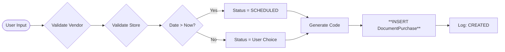
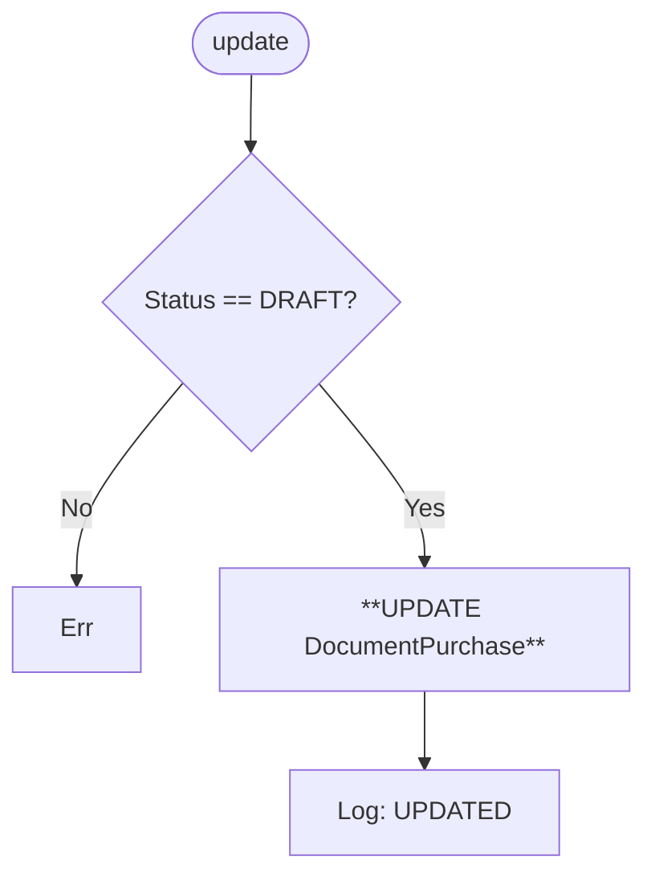
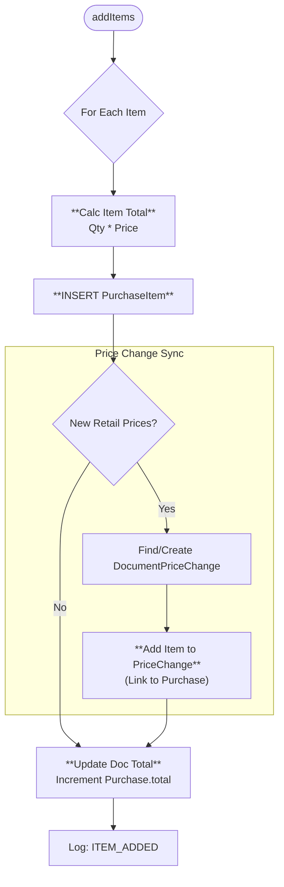
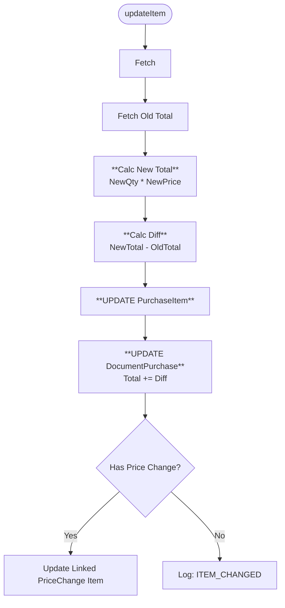
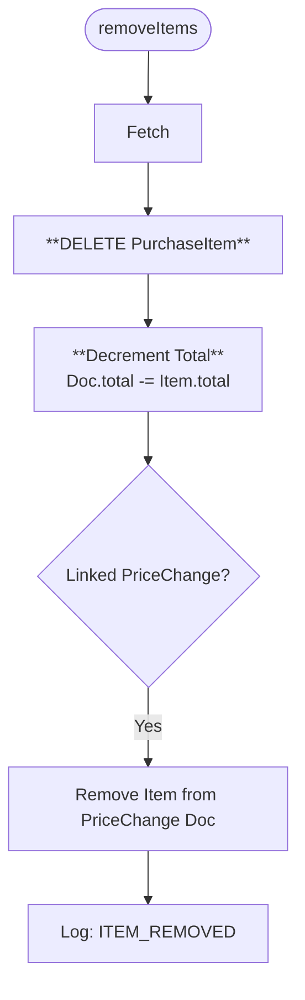
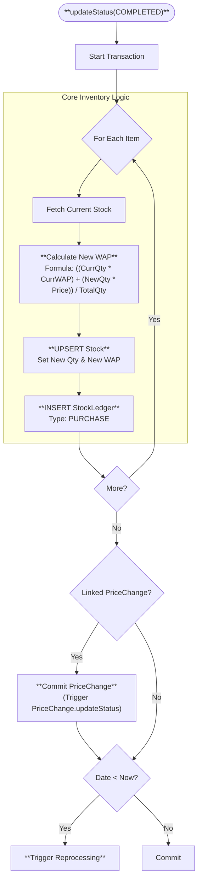
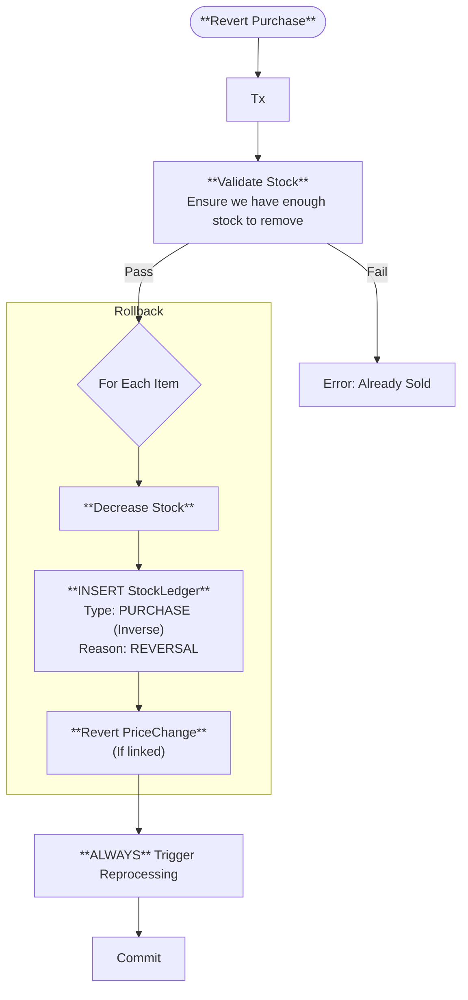
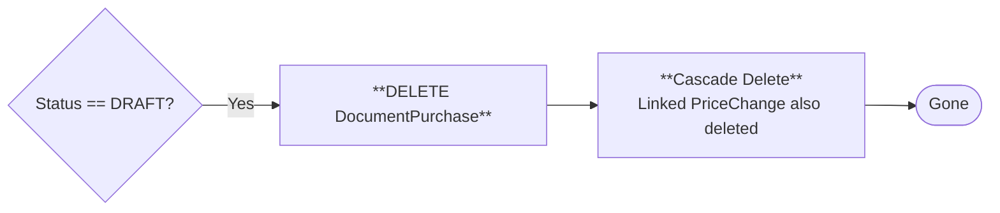

# 🛒 Document Purchase Methods (Visual Architecture)

> **Complete Method Lifecycle** for Purchases.

## 🟢 `create` (Initialization)

**Purpose**: Creates the purchase header.

## 🟡 `update` (Edit Header)

**Purpose**: Changes Vendor, Date, or Notes.

## 🔵 `addItems` (Append & Sync)

**Purpose**: Adds items to purchase. Handles **Price Change synchronization**.

## 🔵 `updateItem` (Modify Line)

**Purpose**: Corrects quantity or buying price.

## 🔴 `removeItems` (Delete Line)

**Purpose**: Removes item from purchase (and potential linked price change).

## 🌟 `updateStatus` (Commit: DRAFT ➔ COMPLETED)

**Purpose**: Stocks items and calculates WAP.

## ↩️ `updateStatus` (Revert: COMPLETED ➔ DRAFT)

**Purpose**: Refunds the purchase (removes stock).

## 🗑 `remove` (Hard Delete)

**Purpose**: Deletes purchase draft.

