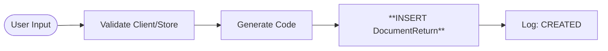
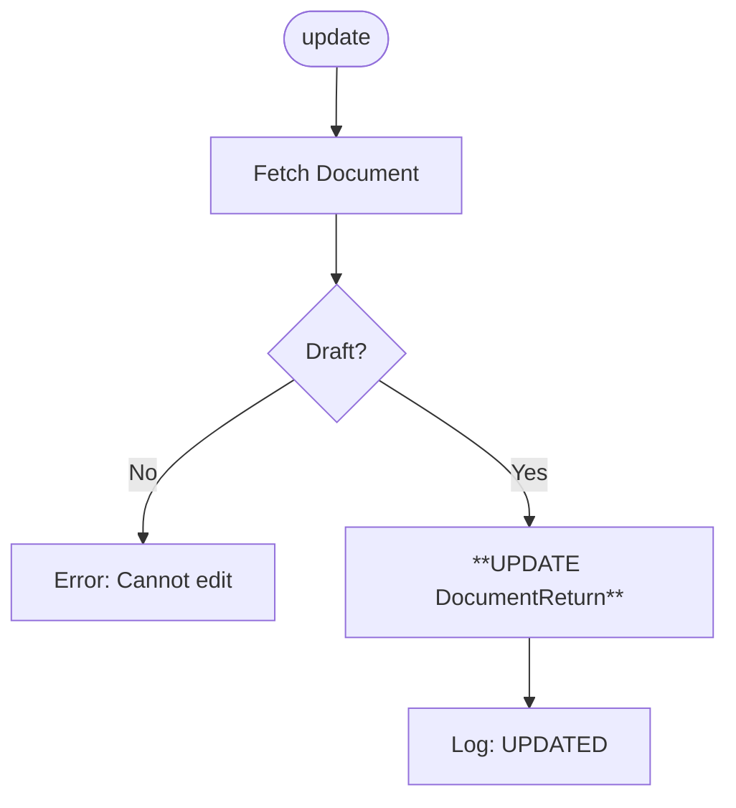
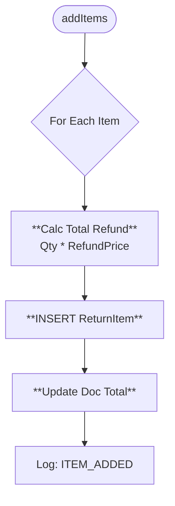
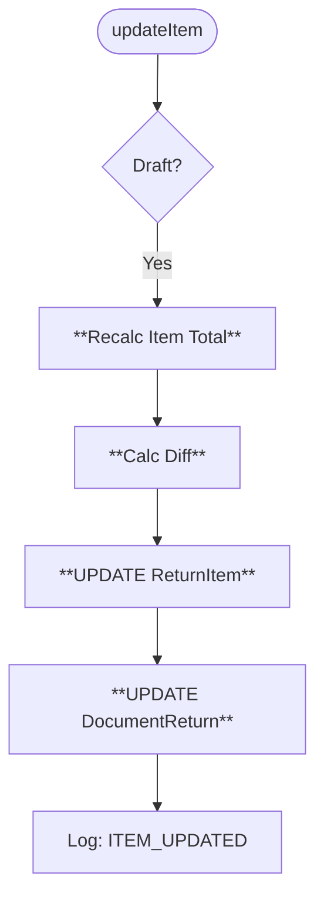
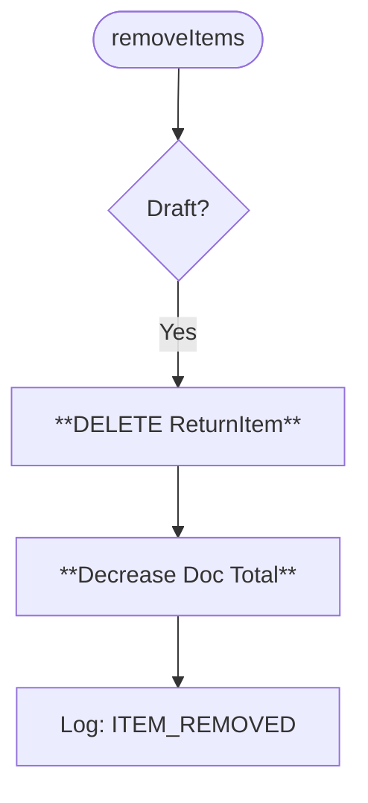
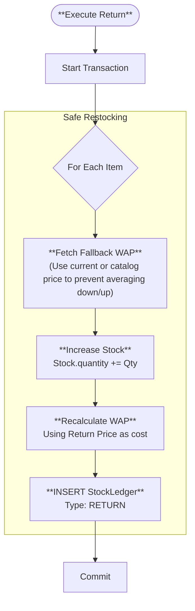
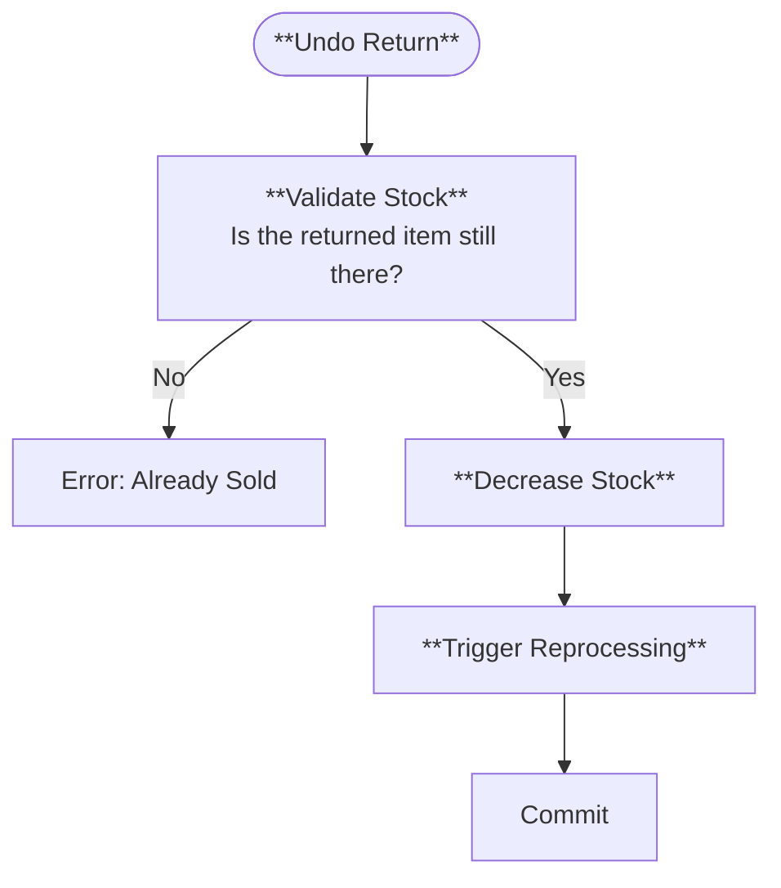
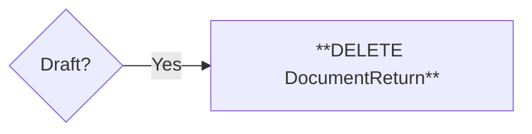

# 🔙 Document Return Methods (Visual Architecture)

> **Complete Method Lifecycle** for Returns.

## 🟢 `create` (Initialization)

**Purpose**: Create Return Header (link to Client).

## 🟡 `update` (Edit)

**Purpose**: Modify return metadata.

## 🔵 `addItems` (Refund Logic)

**Purpose**: Queue items for return. Calculates refund amount (total).

## 🔵 `updateItem` (Correction)

**Purpose**: Change qty or refund price.

## 🔴 `removeItems` (Deletion)

**Purpose**: Remove line.

## 🌟 `updateStatus` (Commit: DRAFT ➔ COMPLETED)

**Purpose**: Put items back into inventory constraints.

## ↩️ `updateStatus` (Undo Return)

**Purpose**: Cancel the return logic.

## 🗑 `remove`

