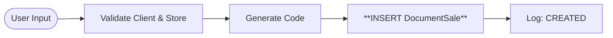
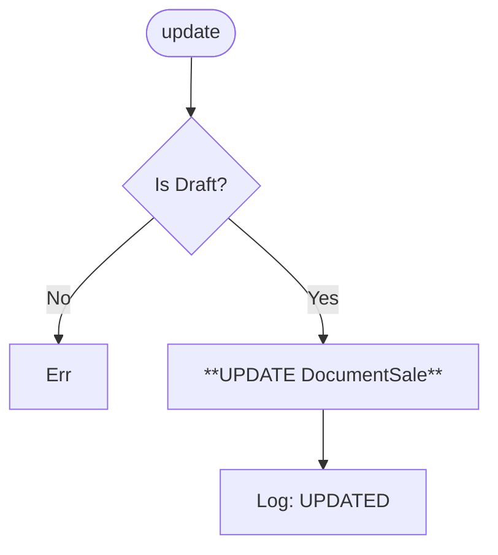
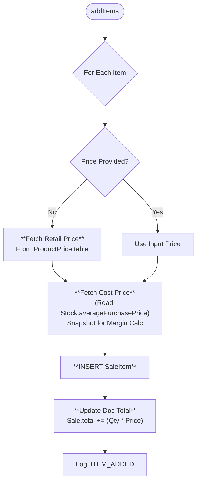
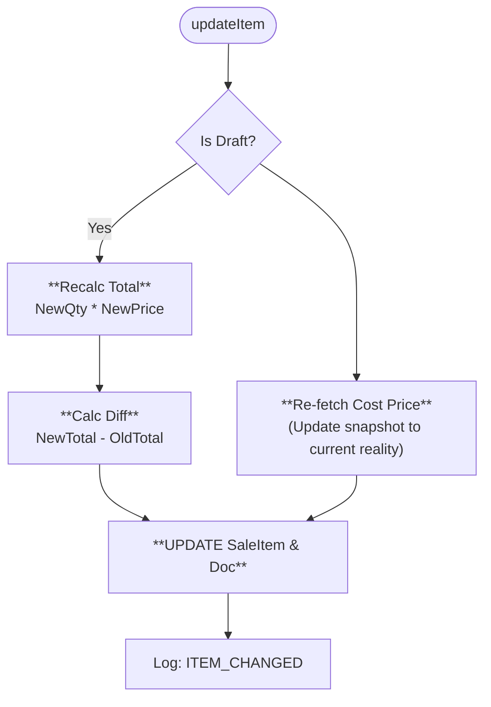
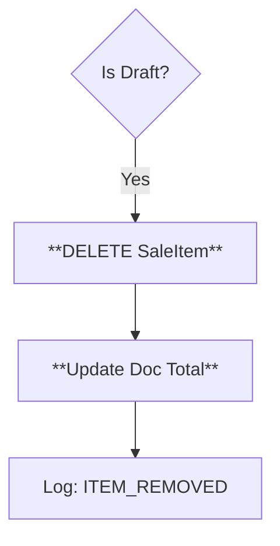
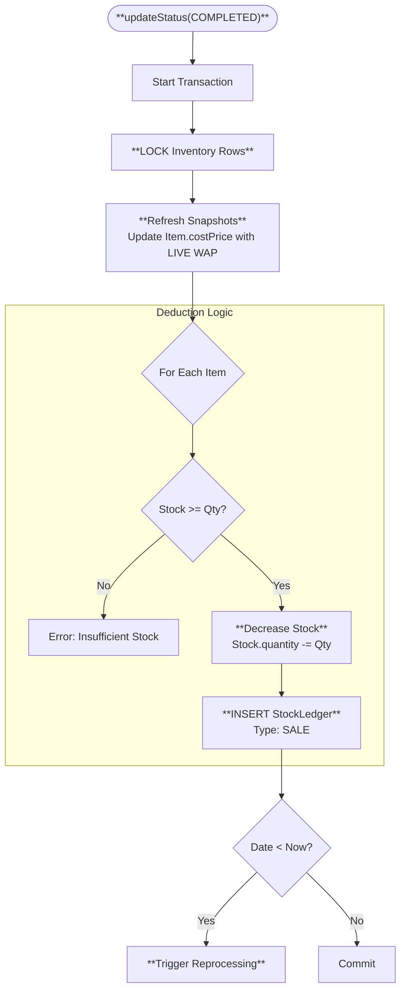
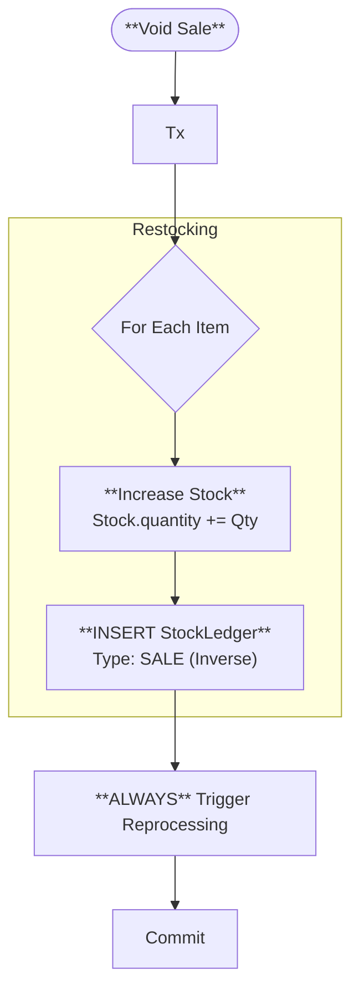
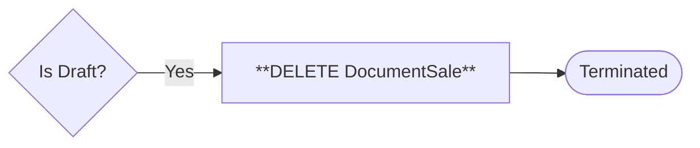

# 🏷 Document Sale Methods (Visual Architecture)

> **Complete Method Lifecycle** for Sales.

## 🟢 `create` (Initialization)

**Purpose**: Creates sale header.

## 🟡 `update` (Edit Header)

**Purpose**: Change Client, Date, or Cashbox.

## 🔵 `addItems` (Smart Add)

**Purpose**: Adds item and **Snapshots Cost Price**.

## 🔵 `updateItem` (Modify Line)

**Purpose**: Change Qty or Price (Discount).

## 🔴 `removeItems` (Delete Line)

## 🌟 `updateStatus` (Commit: DRAFT ➔ COMPLETED)

**Purpose**: Finalizes sale, deducts inventory.

## ↩️ `updateStatus` (Void: COMPLETED ➔ DRAFT)

**Purpose**: Voids the sale, returns items to shelf.

## 🗑 `remove` (Hard Delete)

