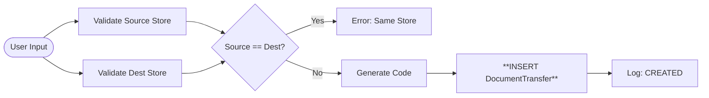
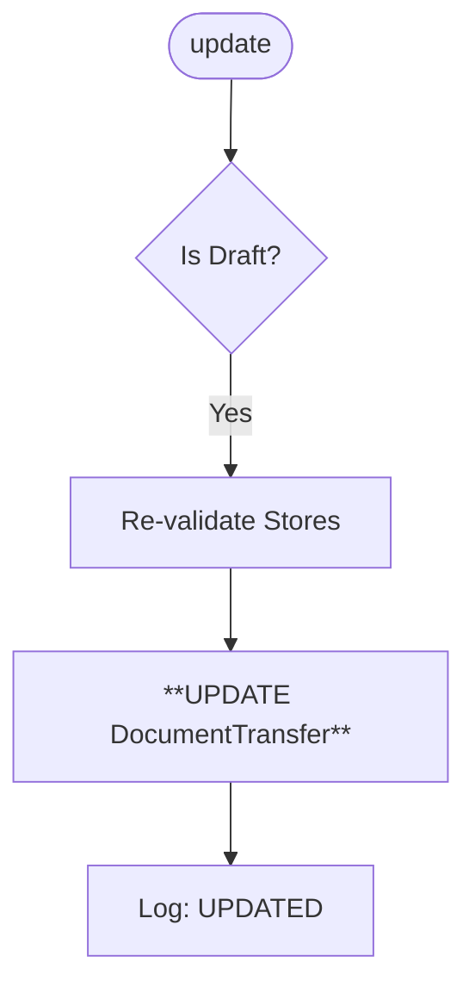
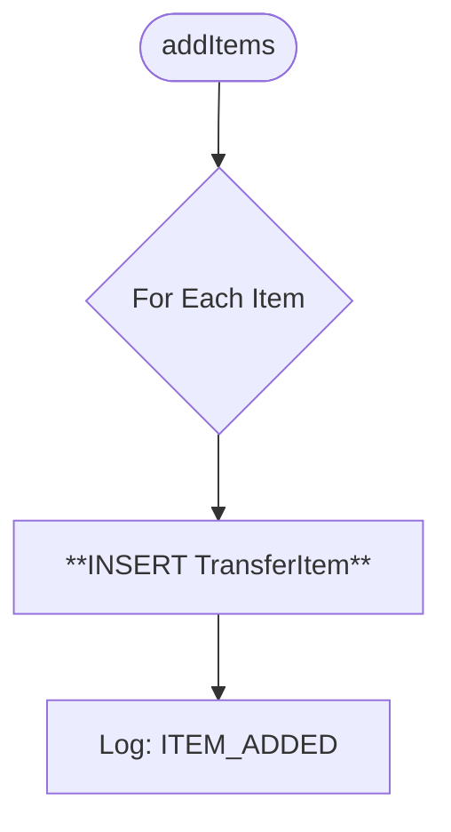
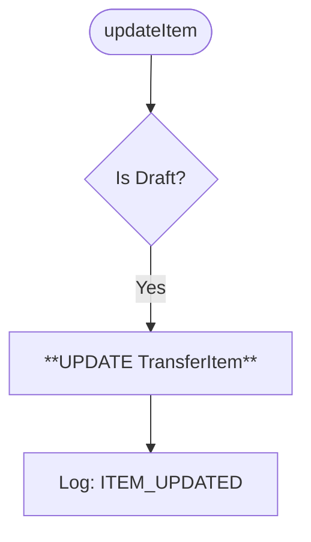
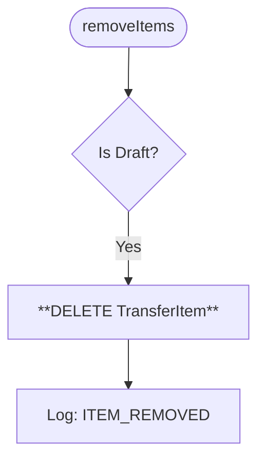
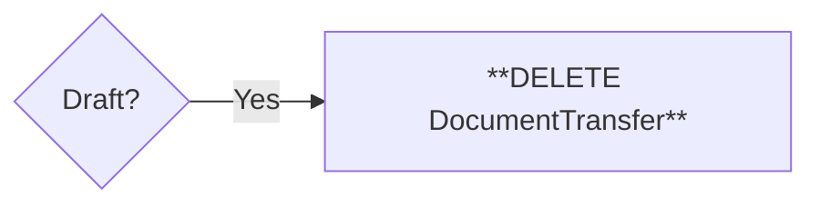

# 🚚 Document Transfer Methods (Visual Architecture)

> **Complete Method Lifecycle** for Transfers.

## 🟢 `create` (Initialization)

**Purpose**: Define Source and Destination.



## 🟡 `update` (Edit Header)

**Purpose**: Change Target Store or Date.



## 🔵 `addItems` (Append)



## 🔵 `updateItem` (Edit Line)

**Purpose**: Change transfer quantity.



## 🔴 `removeItems` (Remove Line)

**Purpose**: Remove item from list.



## 🌟 `updateStatus` (Commit: DRAFT ➔ COMPLETED)

**Purpose**: Moves stock and **Carries WAP** across stores.

```mermaid
flowchart TD
    Start(["**Execute Transfer**"]) --> Tx[Start Transaction]
    
    Tx --> Loop{For Each Item}
    
    subgraph "Source (OUT)"
        Loop --> CheckSrc{"Source Stock >= Qty?"}
        CheckSrc -- No --> Err
        CheckSrc -- Yes --> DecrSrc[**Decrease Source Stock**]
        DecrSrc --> ReadWap[**Read Source WAP**]
        ReadWap --> LogSrc[Log: TRANSFER_OUT]
    end
    
    subgraph "Destination (IN)"
        LogSrc --> IncrDest[**Increase Dest Stock**]
        IncrDest --> CalcWap["**Calculate New Dest WAP**<br/>Mix existing Dest WAP + Incoming Source WAP"]
        CalcWap --> UpdDest[**Update Dest Stock**]
        UpdDest --> LogDest[Log: TRANSFER_IN]
    end
    
    LogDest --> Repro{"Date < Now?"}
    Repro -- Yes --> Job[**Trigger Reprocessing (BOTH STORES)**]
    Repro -- No --> Commit
```

## ↩️ `updateStatus` (Revert: COMPLETED ➔ DRAFT)

**Purpose**: Reverses the flow.

```mermaid
flowchart TD
    Start(["**Undo Transfer**"]) --> Tx
    
    Tx --> CheckDest{"Dest Stock >= Qty?"}
    CheckDest -- No --> Err[Error: Items already used at Dest]
    
    CheckDest -- Yes --> Loop{For Each Item}
    
    subgraph "Reversal"
        Loop --> DecrDest[**Decrease Dest Stock**]
        DecrDest --> IncrSrc[**Increase Source Stock**]
        
        IncrSrc --> Log[Log Inverse Ledger Entries]
    end
    
    Log --> Job[**Trigger Reprocessing (BOTH STORES)**]
    Job --> Commit
```

## 🗑 `remove`


