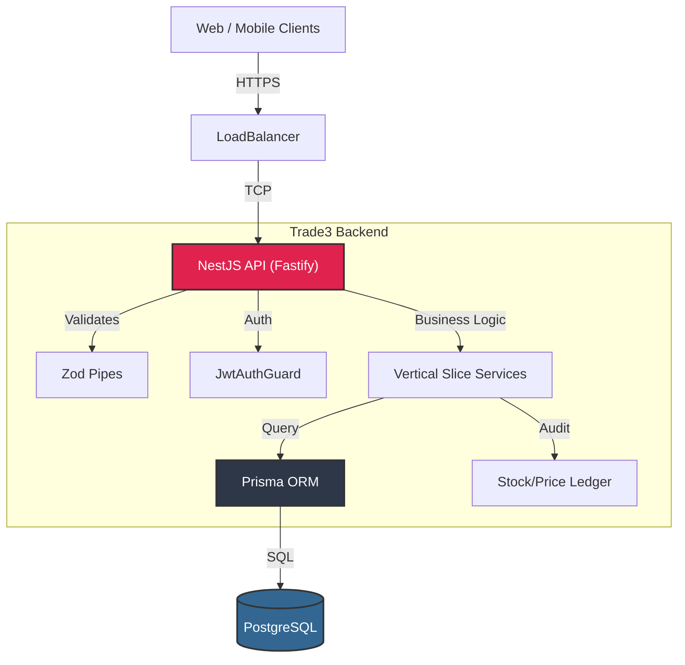
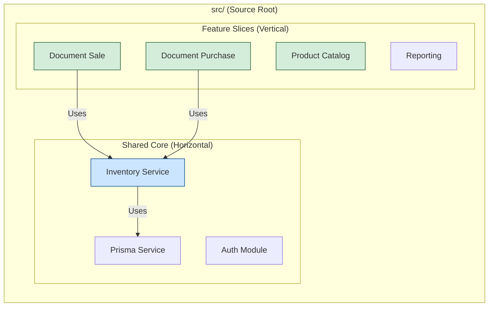
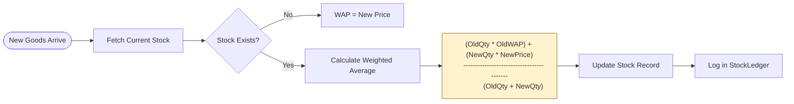
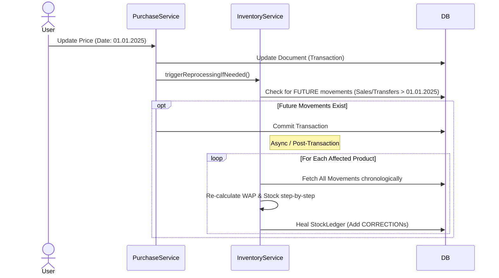
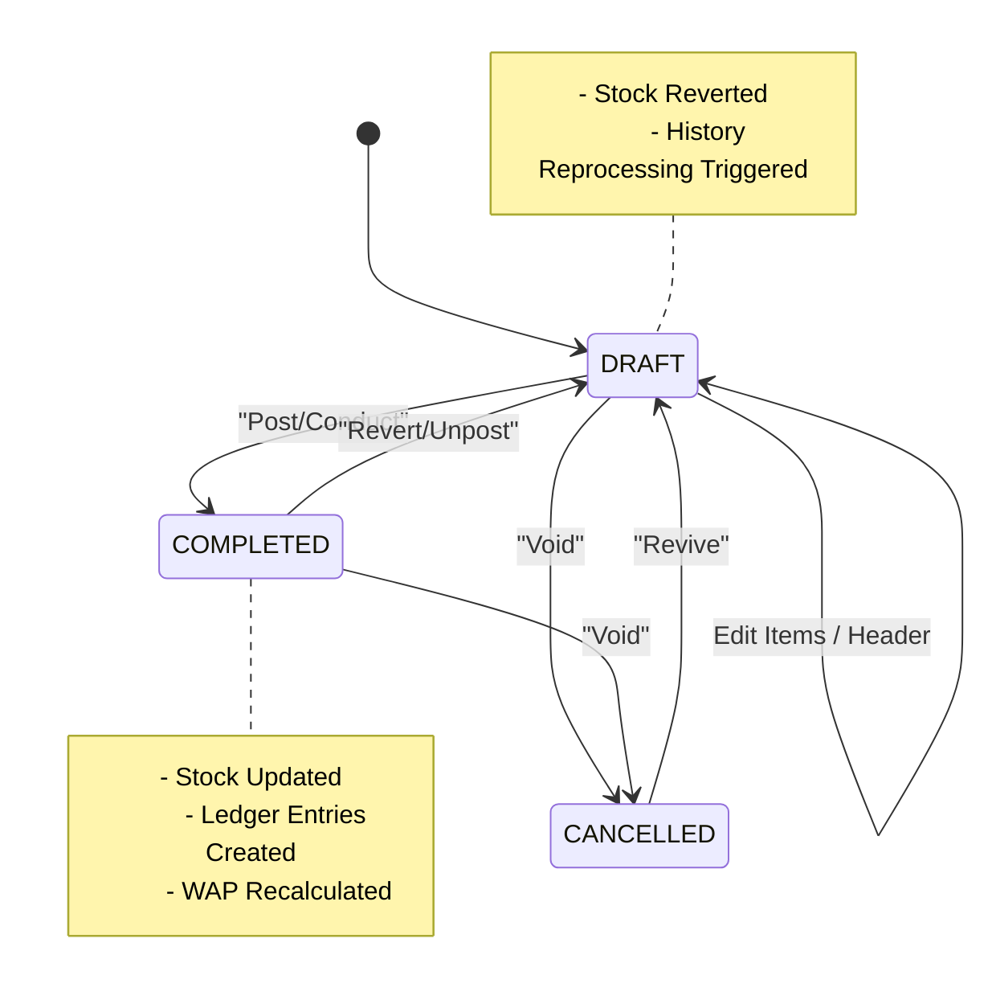
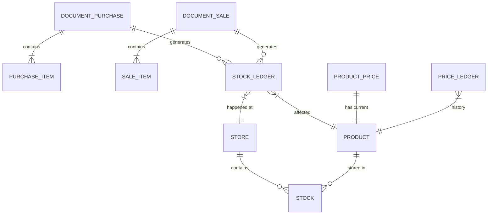

# 🎨 Visual Architecture & Algorithms

> **Visual Guide to Trade3's Core Logic**
> This document uses **Mermaid.js** diagrams to visualize the system structure, data flows, and critical inventory algorithms.

---

## 🏗 1. System Architecture (High Level)

The system is built as a high-performance Monolithic REST API using **NestJS** and **Fastify**.

---

## 🍰 2. Code Organization: Vertical Slices

We avoid "Layered Architecture" (Controllers/Services/Repositories folders). Instead, we group by **Feature**.

---

## 🔄 3. Key Algorithms

### 3.1 WAP Calculation (Weighted Average Price)

How the system calculates the Cost Price of goods when a new Batch (Purchase/Transfer) arrives.

### 3.2 "Time Travel" (Sequence Reprocessing)

What happens when a user edits a document **in the past** (e.g., changes a Purchase price from last month)?

---

## 🚦 4. Document Lifecycle (State Machine)

The lifecycle of any document (Purchase, Sale, Transfer) ensures consistency.

---

## 🧮 5. Database Schema: Key Relations

A simplified view of how Documents connect to the Ledger and Inventory.

