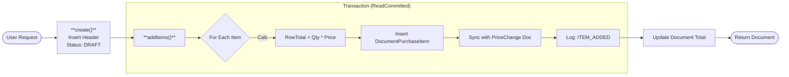

# 📑 Visual Document Workflows

> **Visual Guide to Document Lifecycles & Methods**
> Detailed flowcharts explaining the logic inside key service methods (`create`, `addItems`, `updateStatus`).

---

## 📥 1. Document Purchase (Закупка)

### 🔹 `create` & `addItems` (Drafting)

This process builds the document. No stock changes happen here.



### 🔶 `updateStatus` (DRAFT ➔ COMPLETED)

The critical method that increments stock and recalculates WAP.


---

## 📤 2. Document Sale (Продажа)

### 🔹 `addItems`

Fixes the estimated cost price at the moment of adding to cart.


### 🔶 `updateStatus` (DRAFT ➔ COMPLETED)

Updates cost price to actual and reduces stock.


---

## 🚚 3. Document Transfer (Перемещение)

### 🔶 `updateStatus` (Dual-Store Logic)

Moves stock from Store A to Store B, carrying the WAP value with it.


---

## ↩️ 4. Status Revert (COMPLETED ➔ DRAFT)

The "Undo" logic common to all documents.

```mermaid
flowchart TD
    Start(["**updateStatus(DRAFT)**"]) --> Check{Is COMPLETED?}
    Check -- Yes --> RevertGeneric
    
    subgraph "Generic Revert Logic"
        RevertGeneric --> ValidRev{Safe to Revert?<br/>(Check Negatives)}
        ValidRev -- No --> Error
        ValidRev -- Yes --> Inverse[**Apply Inverse Movement**<br/>Sale -> Add back<br/>Purchase -> Remove]
        Inverse --> Log[Log Revert Action]
        Log --> Job[**ALWAYS Trigger Reprocessing**]
    end
    
    Job --> Update[Set Status = DRAFT]
    Update --> End([Document Re-opened])
```
